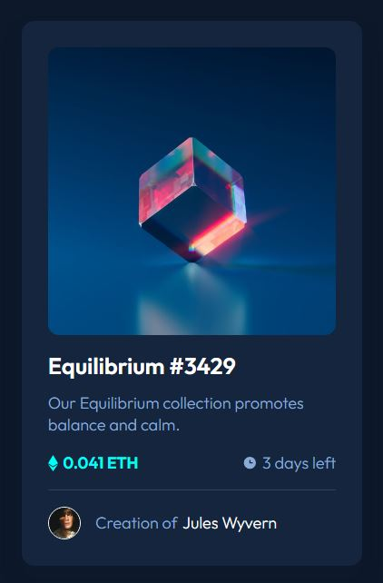

# Frontend Mentor - NFT preview card component solution

This is a solution to the [NFT preview card component challenge on Frontend Mentor](https://www.frontendmentor.io/challenges/nft-preview-card-component-SbdUL_w0U). Frontend Mentor challenges help you improve your coding skills by building realistic projects. 

## Table of contents

- [Overview](#overview)
  - [The challenge](#the-challenge)
  - [Screenshot](#screenshot)
  - [Links](#links)
- [My process](#my-process)
  - [Built with](#built-with)
  - [What I learned](#what-i-learned)
- [Author](#author)

## Overview

### The challenge

Users should be able to:

- View the optimal layout depending on their device's screen size
- See hover states for interactive elements

### Screenshot



### Links

- Solution URL: [https://github.com/pMacadoo/fem-nft-preview-card-component-main](https://github.com/pMacadoo/fem-nft-preview-card-component-main)
- Live Site URL: [https://soft-snickerdoodle-e0a261.netlify.app/](https://soft-snickerdoodle-e0a261.netlify.app/)

## My process

### Built with

- Semantic HTML5 markup
- CSS custom properties
- Flexbox
- CSS Grid
- Mobile-first workflow

### What I learned

Had issues with the image container showing a gap below the image. Resolved it using the `display: block` element.

```css
.nft-card__img > img {
  border-radius: 12px;
  width: 100%;
  display: block;
}
```

## Author

- GitHub - [pMacadoo](https://github.com/pMacadoo)
- Frontend Mentor - [@pMacadoo](https://www.frontendmentor.io/profile/pmacadoo)